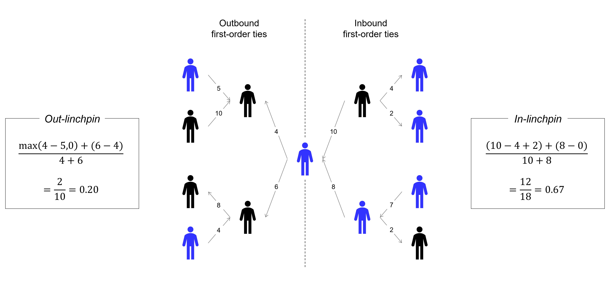

# directed-linchpin-centrality
This project extends the [linchpin centrality](https://github.com/mnemesure/linchpin_centrality) measure - originally described in [Nemesure et al. 2021](https://appliednetsci.springeropen.com/articles/10.1007/s41109-021-00400-8) - by accounting for:
  - The direction of first- and second-order ties, and 
  - The weighting of second-order ties

Such modifications are helpful for capturing the nuances of directed and/or weighted networks that were otherwise unaddressed in the previous iteration.

## Definition 
Suppose we have a directed and weighted graph consisting of a set of nodes and edges. For a focal node $i$, let $j$ denote a first-order neighbor of $i$, and $k$ denote a second-order neighbor of $i$. 

Following, let each tie with an associated direction and weight can be denoted by the following manner notation: 
 - $w_{ij}$: weight of the edge from node $i$ to $j$ 
 - $w_{ji}$: weight of the edge from node $j$ to $i$
 - $w_{jk}$: weight of the edge from node $j$ to $k$
 - $w_{kj}$: weight of the edge from node $k$ to $j$
 
We define two measures of directed linchpin centrality: 

$l^{in}_i = \sum_{j \in F} \frac{w_{ij}-max(\sum_{k \in S} w_{kj} I[A(k)=A(i)],0)}{w_{ij}}$

$l^{out}_i = \sum_{j \in F} \frac{w_{ji}-max(\sum_{k \in S} w_{jk} I[A(k)=A(i)],0)}{w_{ij}}$

## Examples

## Scripts
  - `directed-linchpin-centrality.Rproj` - project that holds all code, data, and packages/dependencies
  - `directed-linchpin.R` - new linchpin centrality code with the modifications outlined above
  - `Linchpin.Centrality.R` - original linchpin centrality code
  - `test_network.R` - code that crosschecks new code against old code for undirected-unweighted networks

